# Final Report: NBA Position Aging Analysis

**DSA 210 — Introduction to Data Science | Spring 2025-2026**  
**Sabancı University**  
**Student:** Tuna Kemer

---

## 1. Motivation

Player performance naturally declines with age, but the rate and pattern of this decline may differ significantly across positions. A point guard who relies on shooting and playmaking may age very differently from a power forward whose game is built on athleticism and physicality. Understanding these differences has real-world implications: NBA teams make multi-year contract decisions worth tens of millions of dollars, and knowing which positions tend to age more gracefully — and why — can meaningfully inform those decisions.

This project explores whether certain positions are more resilient to aging due to differences in their underlying skill profiles. Rather than asking simply "do players get worse with age," the goal is to ask a more specific question: do the *skills* that define each position decay at different rates, and does that explain why some positions hold up better over time?

---

## 2. Data Source

### 2.1 Primary Dataset — nba_api
Season-level per-game statistics were collected using the `nba_api` Python library, covering the 2010–2024 period (14 seasons). The raw dataset contained 7,190 player-season observations including points, assists, rebounds, steals, blocks, turnovers, true shooting percentage (TS%), and plus-minus.

### 2.2 Enrichment Dataset — Kaggle (Damir Dizdarevic)
To enrich the analysis with position labels and advanced metrics, a publicly available Kaggle dataset was merged with the primary data. This dataset provided:
- **Position labels:** PG, SG, SF, PF, C
- **Advanced statistics:** PER, BPM, VORP, Win Shares (WS)

### 2.3 Data Collection & Merging
Data was collected using Python. The two datasets were merged on player name and season. To ensure data quality, only players with a minimum of 1,000 minutes played per season were included. After filtering and merging, the final dataset contained **3,570 player-season observations** across **26 features**.

---

## 3. Data Analysis

### 3.1 Exploratory Data Analysis

EDA was conducted to understand the distribution of players across ages and positions, and to identify initial patterns in how performance metrics behave with age.

**Age Distribution by Position** — All five positions show a similar age distribution, peaking between ages 25–27. The distribution is right-skewed, reflecting that few players sustain long careers past age 33.

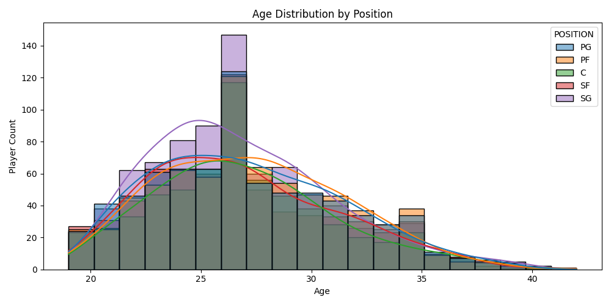

**Stats by Position (Boxplot)** — Point guards lead in assists (median ~5.0), centers lead in blocks (median ~1.1), and scoring is relatively similar across positions.

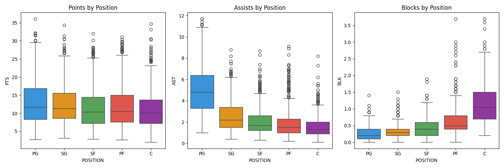

**BPM Trend by Age** — Box Plus/Minus (BPM) generally improves from age 19 to around 28, then stabilizes. Centers show surprising spikes at older ages, likely due to survival bias — only elite centers play into their late 30s.

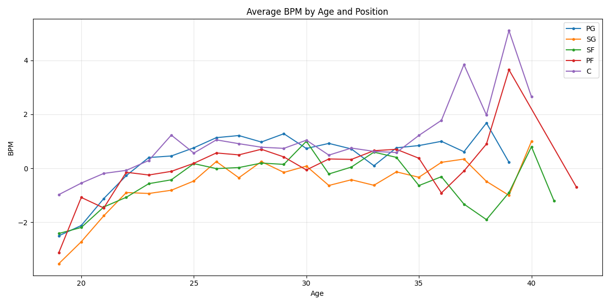

**TS% and BPM Trends (Smoothed)** — Centers maintain the highest true shooting percentage across all ages (~0.59). PGs show the steepest improvement in TS% with age, starting at ~0.51 and reaching ~0.56 by age 35.

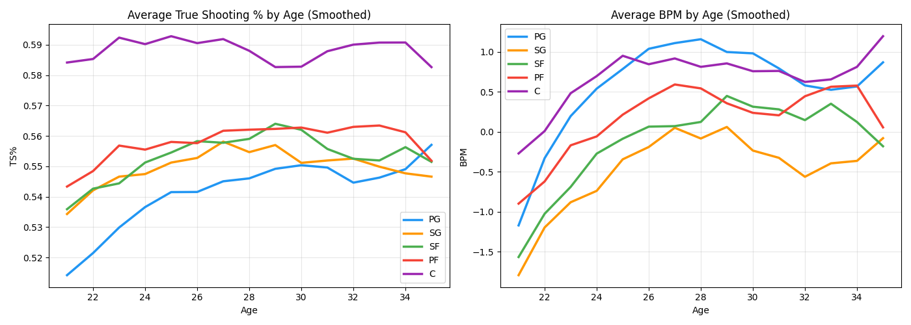

**Correlation Heatmap** — PER, BPM, VORP, and WS are highly correlated with each other (0.80–0.95), indicating they largely capture the same underlying performance. Age shows weak correlations with all statistics (max r=0.16 with BPM).

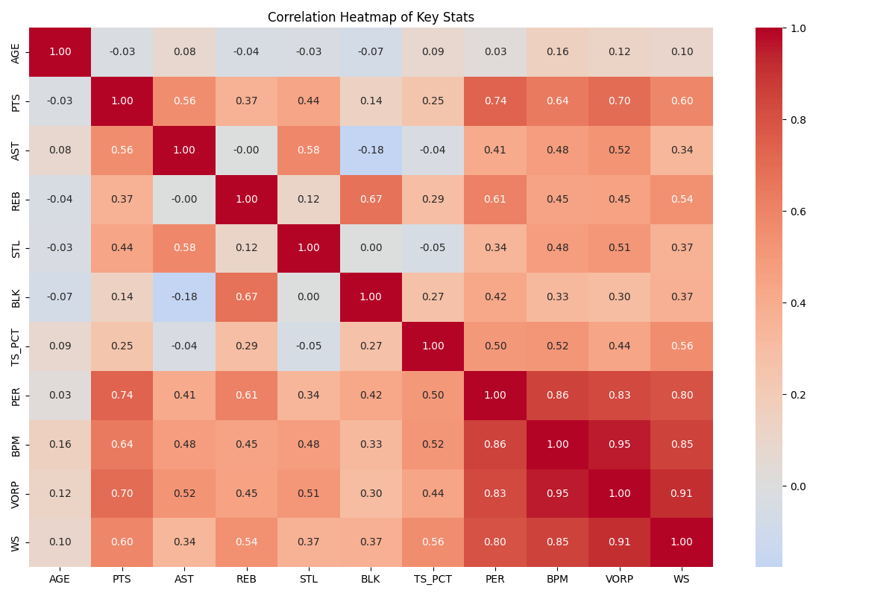

**Skill Groups by Age** — Three skill dimensions were tracked across ages 21–35:
- *Athleticism* (STL/BLK): Declines across all positions, with centers starting highest and declining most
- *Shooting* (3P%): Improves with age across all positions
- *Playmaking* (AST): Remains stable with age, with PGs consistently leading

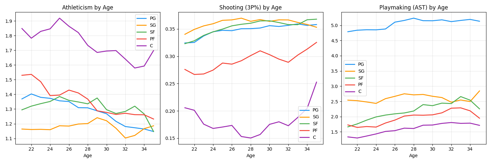

---

### 3.2 Hypothesis Testing

Four formal statistical tests were conducted to validate the EDA findings.

**Test 1 — Do Centers Age Better Than Guards in BPM? (Independent t-test)**

- H₀: No difference in BPM between Centers and Point Guards
- H₁: Centers maintain higher BPM than Guards with age
- Result: T=1.191, p=0.234, Cohen's d=0.066 (negligible effect)
- **Conclusion:** Null hypothesis cannot be rejected. No statistically significant BPM difference between Centers (mean=0.726) and Guards (mean=0.548). The negligible effect size confirms this difference is not practically meaningful.

---

**Test 2 — Does True Shooting % Change With Age? (Pearson Correlation)**

- H₀: No correlation between age and TS%
- H₁: TS% changes significantly with age
- Result: r=0.086, p<0.001 (negligible effect overall; PG: r=0.251, small effect)
- **Conclusion:** Null hypothesis rejected. TS% increases significantly with age overall, though the effect is small. PGs show the strongest improvement (r=0.251, small effect), while Centers show no significant change (r=-0.049, p=0.225). Note: significance is partly driven by the large sample size (3,570 observations).

---

**Test 3 — Do Positions Differ in Performance After Age 28? (One-way ANOVA)**

- H₀: No BPM difference across positions for players over 28
- H₁: Some positions maintain performance better after age 28
- Result: F=30.423, p<0.001, Eta²=0.031 (small effect)
- **Conclusion:** Null hypothesis rejected. BPM differs significantly across positions after age 28, though the effect size is small (Eta²=0.031). SF shows the largest post-28 gain (+0.55 BPM), PF the smallest (+0.30). The large F-statistic reflects the sample size rather than a large practical difference.

---

**Test 4 — Does Athleticism Decline With Age? (Pearson Correlation)**

- H₀: No relationship between age and athleticism metrics
- H₁: Athleticism declines significantly with age
- Result: PG steals r=-0.104 (p<0.01, small effect), PF blocks r=-0.212 (p<0.001, small effect), C blocks r=-0.055 (p=0.175, negligible)
- **Conclusion:** Null hypothesis rejected for PG and PF. PF athleticism declines most sharply (small effect). Centers maintain blocking ability with age, with a negligible and non-significant correlation.

---

### 3.3 Machine Learning

#### Feature Engineering
For each player with 3 or more seasons in the dataset (510 players), career slope features were computed using linear regression over age:

| Feature | Description |
|---|---|
| BPM_SLOPE | Overall performance trend per year of age |
| STL_SLOPE | Steals trend (athleticism proxy for guards) |
| BLK_SLOPE | Blocks trend (athleticism proxy for bigs) |
| TS_SLOPE | True shooting efficiency trend |
| AST_SLOPE | Assists trend (playmaking) |

Average BPM slope by position: PG (+0.113), PF (+0.034), SF (+0.021), SG (+0.006), C (0.000).

#### Model 1 — Ridge Regression
**Task:** Predict a player's BPM slope from their skill trends and position.

- Features: POS_ENCODED, STL_SLOPE, BLK_SLOPE, TS_SLOPE, AST_SLOPE, MEAN_AGE
- Result: R²=0.524 (5-fold CV), R²=0.630 (test set)
- Key finding: TS_SLOPE has the highest coefficient (+0.363), confirming that shooting efficiency trend is the strongest predictor of good aging. Position encoding has near-zero coefficient (-0.002), suggesting position alone does not determine aging trajectory.

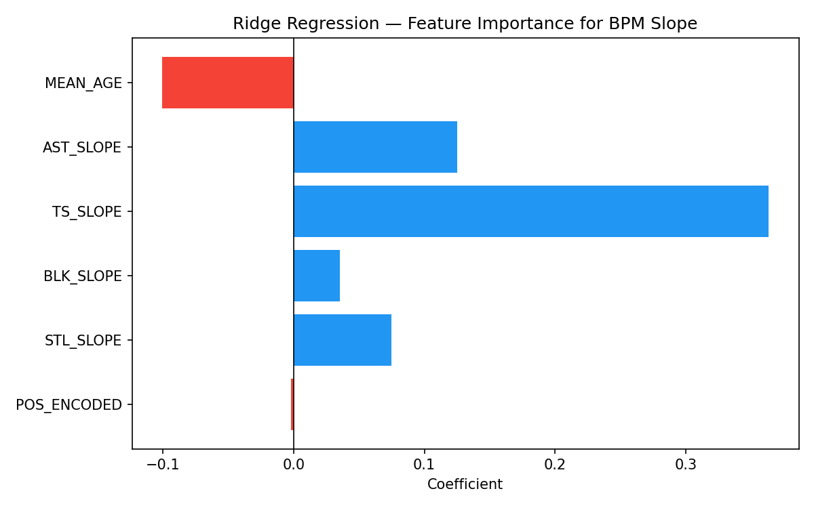

#### Model 2 — K-Means Clustering (k=3)
**Task:** Group players into aging profile clusters based on their slope features.

- Result: 3 clusters identified — declining, stable, and improving players
- Key finding: Cluster composition is distributed similarly across all five positions, suggesting that aging profile is determined more by individual skill trends than by position.

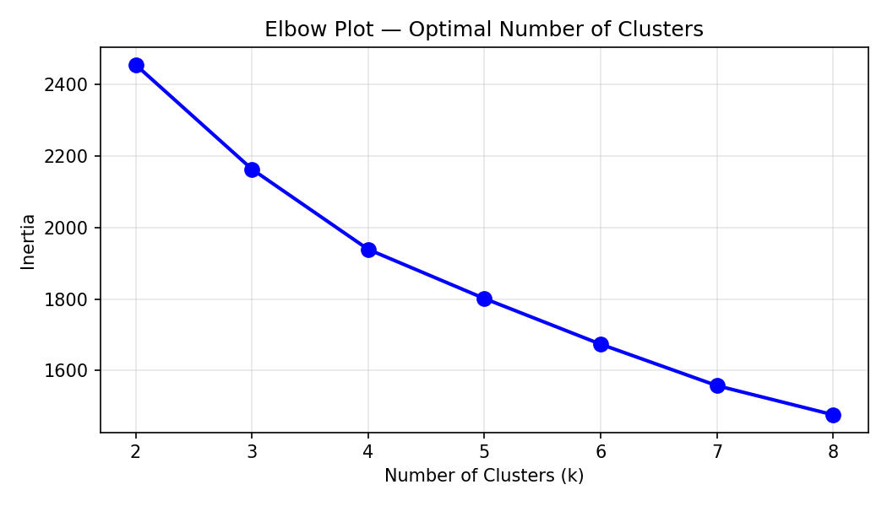
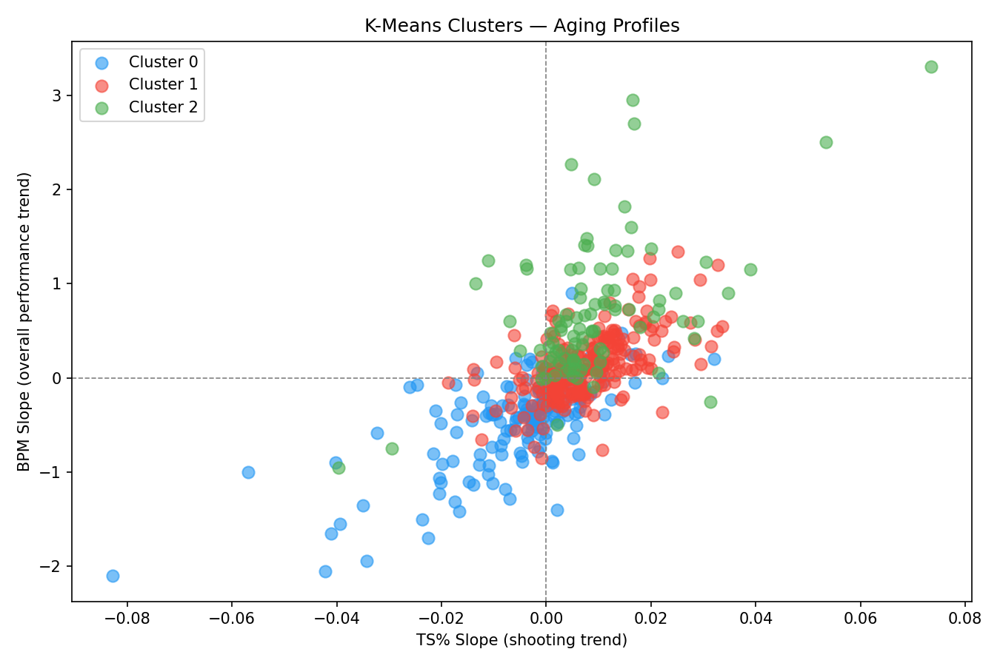

#### Model 3 — Logistic Regression
**Task:** Classify players as "good ager" (positive BPM slope) vs "not good ager."

- Result: Accuracy=0.957 (5-fold CV), 0.941 (test set)
- Key finding: STL_SLOPE and AST_SLOPE are the strongest classification signals.

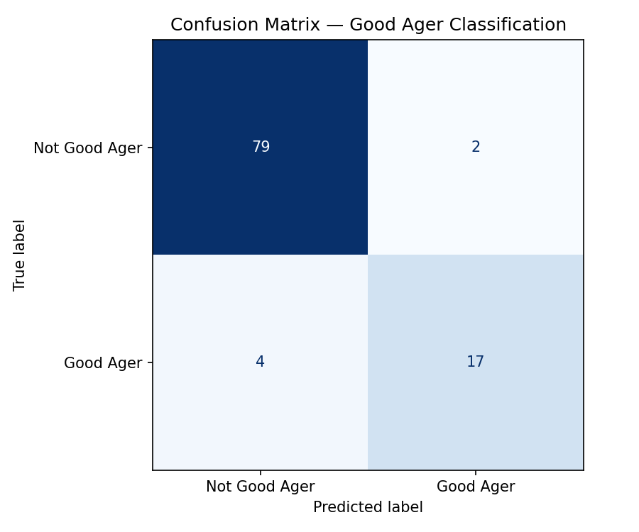
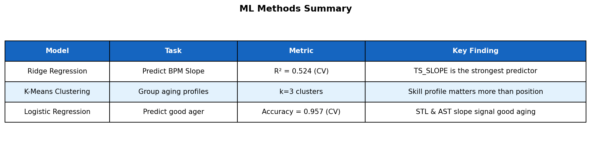

---

## 4. Findings

The analysis produced several consistent findings across EDA, hypothesis testing, and machine learning:

- **Centers maintain the highest shooting efficiency (TS%) across all ages.** This is consistent with their role as high-percentage finishers near the rim.

- **PG shooting improves most significantly with age** (r=0.251, p<0.001). Guards appear to compensate for declining athleticism by becoming more efficient shooters over time.

- **All positions improve overall BPM after age 28**, with Small Forwards showing the largest gain (+0.55) and Power Forwards the smallest (+0.30).

- **PF athleticism declines most sharply with age** (r=-0.212, p<0.001). Power forwards are uniquely vulnerable because their game relies heavily on physical attributes that erode with age.

- **Centers maintain their blocking ability into older ages** (r=-0.055, p=0.175 — not significant), suggesting rim protection is a more durable skill than perimeter athleticism.

- **Skill profile predicts aging better than position.** The Ridge Regression model found that TS_SLOPE (shooting efficiency trend) is the dominant predictor of good aging, while position encoding contributed almost nothing. The K-Means clusters also distributed evenly across positions.

The central finding is that **it is not the position itself that determines aging resilience — it is the underlying skill profile.** Players who improve or maintain their shooting efficiency over time age well regardless of position. PGs tend to age well not because they are guards, but because their skill set (shooting, playmaking) is less dependent on physical decline.

---

## 5. Limitations and Future Work

### 5.1 Limitations

**Survival Bias** — The dataset only includes players who met the 1,000-minute minimum threshold each season. Players who declined sharply and lost playing time are underrepresented, which may make aging curves appear more positive than they actually are.

**Position Classification** — Modern NBA players frequently play multiple positions or switch roles across their careers. Using fixed position labels (PG, SG, SF, PF, C) oversimplifies the reality of contemporary basketball, where positional boundaries have blurred significantly.

**Circularity in ML Pipeline** — In the machine learning section, the "good ager" label used for Logistic Regression was derived from the K-Means clustering output, which itself was trained on the same slope features (BPM_SLOPE, STL_SLOPE, etc.) used as inputs to the classifier. This creates a potential circularity: the model is partially predicting labels that were constructed from the same data it is being trained on. The high accuracy (95.7%) may therefore partly reflect this circularity rather than true generalization. In future work, the "good ager" label should be defined independently — for example, using a player's contract performance outcomes or post-peak career longevity — to obtain a cleaner classification target.

**Limited Time Scope** — The dataset covers 2010–2024. Aging patterns may differ across different eras of basketball due to changes in playing style, training methods, and rule changes.

### 5.2 Future Work

- Apply mixed-effects models to better account for within-player variation across seasons
- Use modern positional groupings (Guard, Wing, Big) rather than traditional five-position labels
- Incorporate injury history data to separate performance decline due to aging from decline due to injury
- Extend the analysis to include contract data to evaluate whether aging-resilient skill profiles correlate with better long-term contract value
- Define "good ager" using an independent criterion to address the circularity issue identified in the ML section

---

## 6. AI Usage Disclosure

AI assistance (Claude by Anthropic) was used in this project in accordance with Sabancı University DSA210 course guidelines. Claude was used for debugging Python code, structuring ML model implementations, and improving report formatting. All analysis decisions, interpretations, and conclusions are the author's own work.
